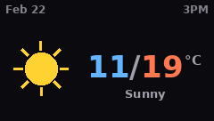

# RT82 Weather Display

Show weather on your Epomaker RT82 keyboard's LCD screen, updated automatically.

## Installation

```bash
pip install rt82display-weather
```

This also installs [rt82display](https://github.com/guysoft/rt82display) as a dependency.

### Linux: udev rules

If you haven't already, set up udev rules for keyboard access:

```bash
sudo curl -o /etc/udev/rules.d/99-rt82.rules \
  https://raw.githubusercontent.com/guysoft/rt82display/main/udev/99-rt82.rules
sudo udevadm control --reload-rules && sudo udevadm trigger
```

Then unplug and replug the keyboard.

## Quick Start

### 1. Configure your location

```bash
rt82weather configure
```

Search for your city and select it from the results.

### 2. Preview the weather image

```bash
rt82weather preview
```

Saves a preview PNG so you can see what the display will look like.

### 3. Upload to keyboard

```bash
rt82weather update
```

### 4. Install as a recurring service

```bash
rt82weather install
```

This sets up a systemd timer (Linux) or launchd agent (macOS) to update
the weather display every few hours automatically.

## Commands

| Command | Description |
|---|---|
| `rt82weather configure` | Search and save your weather location |
| `rt82weather update` | Fetch weather and upload to keyboard |
| `rt82weather preview` | Generate weather image without uploading |
| `rt82weather install` | Install automatic update service |
| `rt82weather uninstall` | Remove the automatic update service |
| `rt82weather status` | Show config, last update, service state |

## Weather Providers

The default provider is **BBC Weather** (same data source as KDE Plasma's
weather widget). The architecture supports adding more providers in the future.

## Display

The 240x136 pixel display shows the date and time, a weather icon,
today's min/max temperature in Celsius, and the condition:



## License

GPLv3 -- see [LICENSE](LICENSE).
